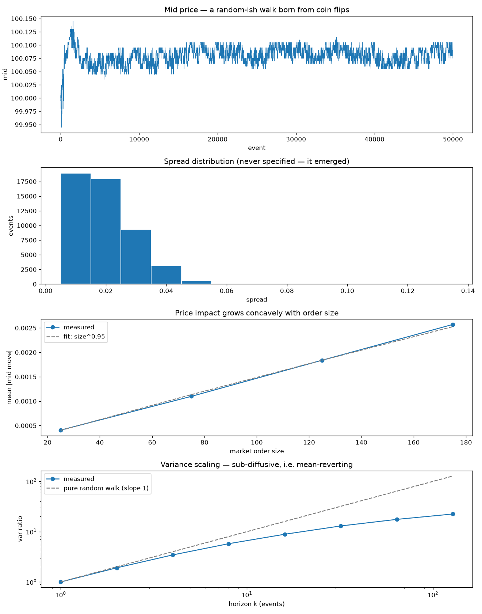

# Limit Order Book & Matching Engine

A price-time priority matching engine — the piece of infrastructure that *is* a modern
exchange — plus a zero-intelligence order flow simulator to run through it.

The interesting result is what comes out of the simulator. The agents flip coins; they have no
strategy at all. The book still produces a realistic spread distribution, concave price impact,
and a mid price that mean-reverts at short horizons exactly the way real equity data does. None
of those were programmed in. They're properties of the matching rules.

17 tests. Results in [RESULTS.md](RESULTS.md), interview notes in [INTERVIEW.md](INTERVIEW.md).

```bash
pip install -r requirements.txt
python -m pytest -q          # 17 passed
python run_simulation.py     # 50k events, writes simulation.png
```



---

## How a matching engine works

### The book

An order book is two sorted collections of resting limit orders — bids below, asks above — and
the gap between the best of each is the **spread**. Everything else is bookkeeping.

```
         asks (sellers)          Someone willing to sell at 101.00
  101.00 |████ 300              is offering; someone willing to buy
  100.60 |██ 150                at 100.50 is bidding. Nothing trades
  100.50 |█ 100     <- best ask  until one side reaches across.
  ---------------------- spread = 0.05
  100.45 |██ 200    <- best bid
  100.40 |████ 400
  100.30 |███ 250
         bids (buyers)
```

Two order types cover almost everything:

- **Limit order** — "buy 100 at no more than 100.50." Executes immediately against anything
  better; whatever's left *rests* in the book and waits. Provides liquidity.
- **Market order** — "buy 100, whatever it costs." Executes immediately against the best
  available prices, walking down the book if it needs to. Consumes liquidity.

The key realization in the implementation: **these are the same operation.** A market order is a
limit order without the price condition. Both go through one `_match()` loop; the only
difference is whether a price ceiling is checked. Keeping matching in exactly one place is what
stops the two paths from silently disagreeing.

### Price-time priority

The rule almost every equity venue uses to decide who fills first:

1. **Price priority** — better prices execute first. A 100.50 bid always fills before a 100.45
   bid, regardless of who arrived first.
2. **Time priority** — among orders at the same price, first-in fills first (FIFO).

Time priority at a price level is why a `deque` per level is the natural structure: append to
the back on arrival, pop from the front when filling. The queue *is* the priority.

This rule is why **queue position is a tradable asset**. If you're 5,000 shares deep in the
queue at the best bid, and only 3,000 shares trade there before the price moves, you don't get
filled at all. Market makers spend real effort getting to the front and staying there — which is
also why most cancels in real markets aren't changes of mind, they're repositioning.

### Trades print at the maker's price

If a resting sell order at 101.00 meets an incoming buy willing to pay 101.50, the trade prints
at **101.00**. The buyer gets price improvement.

The resting order set its terms first and the incoming order accepted them. This isn't just
convention — the whole **maker/taker** economic model rests on it. The maker (resting, provided
liquidity) often earns a rebate; the taker (crossing, consumed liquidity) pays a fee. Get this
backwards and you've inverted the incentive structure of the entire venue.

### Partial fills

The case worth getting right, because most of the others follow from it:

```
Book:     SELL 300 @ 101.10
Incoming: BUY  500 @ 101.10

Result:   300 trade at 101.10, the ask is fully consumed,
          and the leftover 200 REST as the new best BID at 101.10
```

The incoming order was aggressive enough to clear the level and then became the passive side.
An order's identity as maker or taker is not a property of the order — it's a property of each
individual fill.

### Cancels

`cancel()` here removes the order from its deque immediately: O(1) lookup via an id→order dict,
O(level size) to splice it out of the middle.

Production engines usually do **lazy deletion** — flag the order dead and let the matching loop
skip it when it surfaces at the front. That makes cancel O(1) at the cost of some memory. It's
the right trade because in real equity markets **well over 90% of orders are cancelled rather
than filled**; cancel is the hot path, not fill.

---

## The simulator: zero intelligence

Gode & Sunder (1993) showed that "zero-intelligence" traders — submitting random orders with no
strategy whatsoever — reproduce most of a real market's aggregate behavior. The realism lives in
the exchange rules, not in the traders.

The event mix here:

| | Share | What it does |
|---|---|---|
| Limit order | 60% | random side, price offset ~ \|N(0, 3 ticks)\| from the mid; 80% passive, 20% crossing |
| Market order | 25% | random side, size uniform 10–200 |
| Cancel | 15% | a uniformly random resting order |

This is a **null model**, and that's the point of it. Any stylized fact it reproduces needs no
behavioral explanation — you cannot claim your favorite market phenomenon reveals something
about trader psychology if a book full of coin-flippers produces it too.

What it produced over 50,000 events (details and numbers in [RESULTS.md](RESULTS.md)):

- **A spread distribution** — mean 0.0198, at the 1-tick minimum 37.9% of the time. The spread
  is not a parameter anywhere in the code.
- **Concave price impact** — impact ∝ size^0.95. Bigger orders move the mid more, sublinearly.
- **A sub-diffusive mid** — lag-1 autocorrelation of −0.044, and variance growing like k^0.64
  rather than k (Hurst exponent 0.32 against 0.50 for a true random walk). The mid mean-reverts
  at short horizons, which is exactly the signature real tick data shows.

---

## Layout

```
├── run_simulation.py    # driver: spread, depth, impact, variance scaling
├── src/
│   ├── order.py         # Order and Trade types, tick rounding
│   ├── orderbook.py     # the matching engine
│   └── simulator.py     # zero-intelligence order flow
└── tests/               # 17 tests, written as matching scenarios
```

`tests/test_orderbook.py` is worth reading as the specification — each test is one rule of the
matching algorithm stated as an executable scenario (maker pricing, FIFO at a level, sweeping
levels in price order, partial fill remainder resting, cancels preserving queue position).

## Design notes

**Prices as ticked floats.** `to_tick()` snaps every price to the 0.01 grid so equal prices
compare equal as dict keys. Real engines store **integer ticks** and never touch a float,
because `0.1 + 0.2 != 0.3` and a price that fails an equality check silently creates a phantom
level. The rounding here is a readable compromise, and the code says so.

**Timestamps as a sequence number.** Time priority needs only an ordering, not a clock. A
monotonically increasing integer is both sufficient and immune to clock skew — which is exactly
what real venues use for sequencing.

**`Order` is mutable, `Trade` is frozen.** An order's remaining quantity changes as it fills;
a trade is a historical fact and must never change after it prints.

## Known simplifications

- Single symbol, single venue. No cross-venue routing, no NBBO, no Reg NMS.
- No order types beyond limit and market: no stops, icebergs, IOC/FOK, pegged, or
  auction-only orders.
- No opening or closing auction — a large share of real daily volume trades in exactly those,
  under different rules (a single clearing price, not continuous matching).
- No self-trade prevention, no fee/rebate model, no risk checks.
- No latency. Every order arrives instantly and in submission order, which erases the entire
  subject matter of low-latency trading.
- Zero-intelligence agents never reprice, so passive orders pile up far from the touch in a way
  real books don't — the depth profile is the least realistic output here, and RESULTS.md says
  why.

## Reading

- Gode & Sunder (1993), *Allocative Efficiency of Markets with Zero-Intelligence Traders* — the
  original result this simulator reproduces.
- Bouchaud, Bonart, Donier & Gould, *Trades, Quotes and Prices* — the modern reference on
  microstructure and price impact.
- Larry Harris, *Trading and Exchanges* — how venues actually work, institutionally.
- O'Hara, *Market Microstructure Theory* — the adverse-selection models (Glosten-Milgrom, Kyle).
